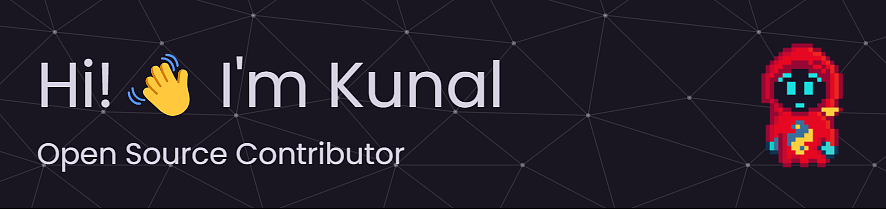

    

<h3 align="center">I'm a Python developer who loves playing with data. I enjoy using Python to analyze datasets and uncover interesting insights. From cleaning data to visualizing trends, I'm passionate about every aspect of the data analysis process. Let's work together to make sense with numbers!</h3>

 

 

  

- 🔭 I’m currently working on a **Motion Detection App**

- 🌱 I’m currently learning **Flask and Django**

- 💼 All my projects are available on this **Portfolio Website**

- 🚀 I update my **[Twitter](https://twitter.com/kunalfr_)** with what I code daily!

 

<h3 align="left">Connect with me:</h3>

 

<h3 align="left">Languages and Tools:</h3> 

 

<h3 align="left">Github Stats:</h3> 

